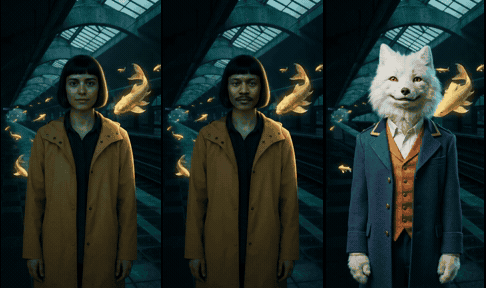
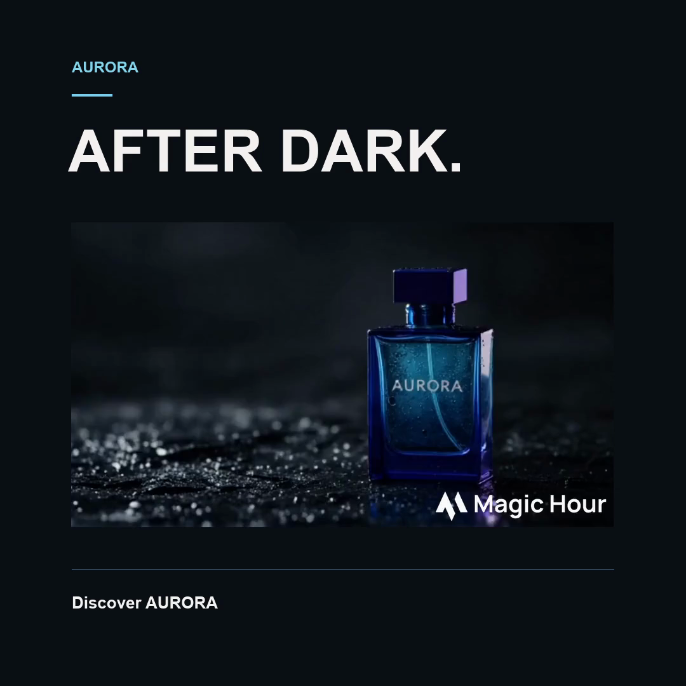

# Magic Hour AI media skills

Animate your photo. Put yourself in a scene. Give your character a performance. Turn an impossible idea into a video. Tell your AI agent what you want; these skills guide the creative decisions, run [Magic Hour's creation MCP](https://github.com/magichourhq/magic-hour-mcp) or [API](https://docs.magichour.ai/api-reference), inspect the result and save files you can reuse.

[See actual outputs and reproducible examples](docs/evidence.md) · [Explore advanced recipes](#go-further) · [Get your first result](docs/quickstart.md)

[](examples/midnight-remix)

One scene, three treatments: [animate the photo](examples/midnight-remix/remix.mp4), [change the face](examples/midnight-remix/face-swap.mp4), or [replace the character](examples/midnight-remix/character-replace.mp4). Actual MCP outputs; [all inputs, prompts, costs and limitations](examples/midnight-remix).

## Start here

**New to skills? Paste this into Codex or Claude Code:**

> Set up the official Magic Hour skills from https://github.com/magichourhq/skills for this project and connect the Magic Hour creation MCP. Reuse any existing connection. Handle the installation and configuration you can access; guide me through only the sign-in or secure credential step that needs me. Never ask me to paste a key into chat. Verify the connection with an authenticated account read. Then help me make one useful asset from my brief; use my existing budget or ask for a spending limit before generating.

Your agent needs permission to run local commands. You need a [Magic Hour account and API key](https://magichour.ai/developer); no code writing, server hosting or repository clone is required. Skills are free to install; generation uses credits. [Step-by-step setup and supported clients →](docs/quickstart.md)

**Prefer the install command?**

```sh
npx skills add magichourhq/skills
```

Choose your agent and desired skills. Already connected and installed? Attach a photo and ask: **“Turn this into a short scene where something impossible happens around me. Keep me recognizable. You choose the direction, work within my budget and show me the finished video.”** No model names or API parameters needed. If you only want one general entry point, install `magic-hour-media`; it can route the job without requiring the rest.

## Choose your workflow

Prefer a native plugin? See [Claude Code and Codex plugin installation, plus Cursor packaging](docs/native-install.md). The plugin uses the same skills and your existing Magic Hour connection.

| I want to…                                  | Skill                                                                       | What it adds beyond a tool call                                                                  |
| ------------------------------------------- | --------------------------------------------------------------------------- | ------------------------------------------------------------------------------------------------ |
| Create or recover general media             | [magic-hour-media](skills/magic-hour-media)                                 | Select the operation, finish asynchronous jobs and retrieve files without duplicate paid retries |
| Animate my photo or create a transformation | [magic-hour-image-to-video](skills/magic-hour-image-to-video)               | Fix and inspect the still before motion; direct the action, reveal and end state                 |
| Put my face into an existing clip           | [magic-hour-face-swap](skills/magic-hour-face-swap)                         | Select the intended cast, preserve the performance and inspect faces through turns               |
| Turn an idea into a video                   | [magic-hour-text-to-video](skills/magic-hour-text-to-video)                 | Build a readable setup and payoff; choose when an identity reference is necessary                |
| Transform or edit my image                  | [magic-hour-image-editing](skills/magic-hour-image-editing)                 | Separate requested changes from protected features and prepare a useful animation frame          |
| Make a talking portrait or lip-sync clip    | [magic-hour-talking-video](skills/magic-hour-talking-video)                 | Approve speech first, match timing and caption the final cut                                     |
| Make my character perform this action       | [magic-hour-character-replace](skills/magic-hour-character-replace)         | Choose replace versus animate, select the subject and preserve the supplied performance          |
| Edit or repurpose existing footage          | [magic-hour-video-editing](skills/magic-hour-video-editing)                 | Choose generative edits versus precise local changes and preserve action/audio                   |
| Make visuals for my music                   | [magic-hour-media: music](skills/magic-hour-media/references/music.md)      | Choose performance versus audio-guided visuals and preserve the selected musical phrase          |
| Keep a character consistent across scenes   | [magic-hour-character-consistency](skills/magic-hour-character-consistency) | Separate identity from pose/style references and review continuity across shots                  |
| Make a thumbnail or episode cover           | [magic-hour-thumbnails](skills/magic-hour-thumbnails)                       | Build a truthful visual hook, preserve references and judge readability at feed size             |
| Make a product shot or website hero         | [magic-hour-product-visuals](skills/magic-hour-product-visuals)             | Preserve geometry and labels, plan copy space and inspect the delivered file                     |
| Finish an ad or matching campaign set       | [magic-hour-campaign-kit](skills/magic-hour-campaign-kit)                   | Reuse a brand reference, compose exact copy and deliver finished placements                      |
| Build or apply a brand kit                  | [magic-hour-brand-kit](skills/magic-hour-brand-kit)                         | Deliver exact identity rules, editable sources and finished applications                         |
| Create a product listing image set          | [magic-hour-marketplace-images](skills/magic-hour-marketplace-images)       | Preserve the actual product and compose useful images from verified facts                        |
| Turn a source into a narrated explainer     | [magic-hour-explainer-video](skills/magic-hour-explainer-video)             | Ground the script, finish speech, reuse a visual identity and assemble the complete cut          |

Install one: `npx skills add magichourhq/skills --skill magic-hour-image-editing`. Install all: `npx skills add magichourhq/skills --skill '*'`. Each skill works independently; you do not need the whole collection for a single job.

## Try a real job

Attach your source media and use the matching prompt. The agent should use the current tool schema and your existing budget, not ask you to fill in API parameters.

**Portrait → impossible scene → video**

> Put me in a midnight train station with golden fish swimming through the air. Keep my face and clothes. Fix the still with AI Image Editor if needed, inspect it, then animate my reaction and the fish. Choose the shot, work within my budget and deliver a finished vertical video.

**My face + a clip → recast performance**

> Put my face onto the main performer in this clip. Keep the original action, clothes and sound, and leave everyone else alone. Check the face through turns and cuts. Use my existing budget and show me the finished clip.

**An idea → one clear reveal**

> Make a five-second vertical video of an ordinary elevator opening onto the moon. No specific person or reference is needed. Choose the settings, leave time to see the reveal and deliver the video within my budget.

**My character + a performance → character remix**

> Replace the performer in this clip with my character. Keep the setting and performance. Choose the right mode, inspect the body and hands through the action, and deliver the finished video within my budget. Keep the reference so we can make the next episode.

**Speech + portrait → talking clip**

> Make a talking clip from my portrait and recording, with captions. Keep the full speech through the last word. Handle timing, check the face and mouth movement, then caption the final cut. Save both clean and captioned versions. Include both steps in my budget.

The agent should carry each request through to the file, make delegated creative choices and explain any failed requirement. It should reuse your budget and accepted work instead of repeatedly asking the same questions.

## Go further

These are instructions for real jobs, with inputs, creative decisions, recovery steps and deliverables. Each installs with its skill; you don't need to read them before asking for the result.

| Job                                                             | Recipe                                                                                                                                                     |
| --------------------------------------------------------------- | ---------------------------------------------------------------------------------------------------------------------------------------------------------- |
| A supplied photo or clip becomes a personal remix               | [Remix direction and routing](skills/magic-hour-media/references/remix.md)                                                                                 |
| Alternate worlds, reactions and impossible reveals              | [Directing the moment](skills/magic-hour-image-to-video/references/transformations.md)                                                                     |
| A soundtrack becomes a performance or visual sequence           | [Music and performance](skills/magic-hour-media/references/music.md)                                                                                       |
| Catalog, lifestyle, close-up and hero images from one product   | [Reference photoshoot](skills/magic-hour-product-visuals/references/photoshoot.md)                                                                         |
| Background changes, relighting and difficult reframing          | [Faithful image edits](skills/magic-hour-image-editing/references/faithful-edits.md)                                                                       |
| A short film with coherent shots and motion                     | [Multi-shot direction](skills/magic-hour-image-to-video/references/multi-shot.md)                                                                          |
| A recurring cast, new angles and continuity at cuts             | [Characters across a series](skills/magic-hour-character-consistency/references/series.md)                                                                 |
| A readable cover with editable headline and deliberate variants | [Thumbnail direction](skills/magic-hour-thumbnails/references/cover-design.md)                                                                             |
| Presenter series, pronunciation and language versions           | [Speech and localization](skills/magic-hour-talking-video/references/localization.md)                                                                      |
| Turn existing footage into multiple finished placements         | [Repurpose a master](skills/magic-hour-video-editing/references/repurpose.md)                                                                              |
| Exact copy, finished ads and next month's campaign              | [Finishing](skills/magic-hour-campaign-kit/references/finishing.md) · [Reusable brand brief](skills/magic-hour-campaign-kit/references/brand-reference.md) |

[Answers to common media-generation questions →](docs/workflow-guide.md) · [What we have actually verified →](docs/evidence.md)

## Inspect the actual outputs

**Midnight remixes:** [Original portraits, a floating-koi scene, generated performance and moon-elevator reveal](examples/midnight-remix) provide a reproducible starting point for personal transformations and recasting. The case records exact inputs, all jobs, charged credits and failed criteria. These are fictional demo subjects, not customer media or evidence of virality.

**Brand kit and listing set:** [AURORA's 2K catalog edit, exact-copy layouts, editable SVG and three-page brand guide](examples/aurora-listing) turn one 200-credit generation into several deliverables. **Narrated explainer:** [Nori's complete video, original speech, generated motion and editable timeline](examples/nori-explainer) shows reference reuse and full-cut assembly. The case records imperfect motion control and the outstanding audio listening review.

These are original Magic Hour web-app and authenticated MCP outputs plus a local finishing example. Every case links to inputs, exact prompts, settings and limitations.

| Approved product still                                                      | Edited catalog image                                                                           | Finished layout                                                                      |
| --------------------------------------------------------------------------- | ---------------------------------------------------------------------------------------------- | ------------------------------------------------------------------------------------ |
|  |  |  |
| [Image + motion comparison](examples/aurora)                                | [All five editing attempts](examples/aurora-edits)                                             | [MP4 + editable copy + render recipe](examples/aurora-finished)                      |

The guided video retains one readable label where the generic example duplicates it. Two editing attempts ignored the square setting; switching models corrected it. Two vertical edits still missed exact placement, which informed the separate layout step. Those failures are included, not discarded.

The [Nori character case](examples/nori-character) adds five real MCP outputs: an original robot and two paired scene comparisons. The shorter prompt preserved details better in the greenhouse; added identity instructions helped in the garden. All attempts, exact prompts and 45 charged credits are recorded, including the rejected output with extra scarf ends.

The [Nori thumbnail case](examples/nori-thumbnail) adds two authenticated MCP edits, an editable headline and full-size/small previews. The direct version adds unrequested text and miniature scenes; the finished version uses one large subject. Both attempts and their 200-credit cost are included. Audience response is unmeasured.

The finished ad has about one second of generated motion followed by a hold, six seconds total, and preserves the source watermark. It is a composition demonstration. The cases use fictional subjects and do not establish general superiority. See the [evidence index](docs/evidence.md) for completed runs, failed criteria and remaining comparisons.

## Make the next job easier

Keep approved references, clean masters, exact copy, voice choices, project IDs and accepted decisions in your project. On the next job, ask “use my other face,” “change the ending” or “make the next episode” and reuse everything unaffected. A new caption, crop or download link should not require paying to recreate accepted footage. Commercial projects can also use the [reusable brand reference](skills/magic-hour-campaign-kit/references/brand-reference.md).

## Questions

**How does this compare with Higgsfield's skills?** See the [dated capability and evidence comparison](docs/capability-coverage.md), including workflows we can demonstrate and backend capabilities these instructions do not provide.

**Do I need both a skill and MCP?** The skill provides workflow instructions. The MCP executes Magic Hour tools. Use the API instead if your project already integrates it. Installing a skill does not authenticate your account.

**Which model should I use?** Choose current supported settings for the task and budget. Model lists and pricing change; the agent reads live schemas. [Observed failures and routing decisions →](skills/magic-hour-campaign-kit/references/model-observations.md)

**Why create or edit an image before video?** It lets you correct identity, composition and label problems before paying for motion. The approved still becomes the video input. [Detailed decision guide →](docs/workflow-guide.md#should-i-use-text-to-video-or-image-to-video)

**Something failed?** Keep the project ID. A polling timeout or expired URL usually needs retrieval, not a duplicate generation. [Troubleshooting →](docs/quickstart.md#unstick-the-first-run)

## Contribute a useful workflow

Start with a distinct user job, a reproducible failure or an output that improves a real task. Include source provenance, settings, all attempts/costs, accepted and failed criteria, and honest validation limits. Keep skill instructions concise and self-contained. Do not add model-price catalogs or claim quality, citations or revenue results without evidence. [Report an issue](https://github.com/magichourhq/skills/issues).

## License

[MIT](LICENSE). Example provenance and any production limitations are recorded with each case.
