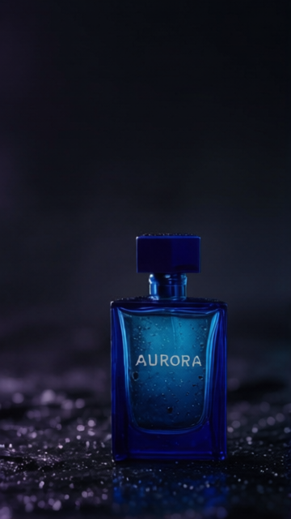

# AURORA: reference editing, placement, and recovery

Generated September 10, 2026 in the signed-in Magic Hour web app. Every edit started from the same [original AURORA image](../aurora/guided-image.png), project `cmtvy7tir00sol101laiyl38p`. None used the preceding edit as its source. These are original, unretouched generated files.

This case tests the image-editing and campaign-kit decision process. It is not an installed-agent MCP evaluation, a statistically controlled comparison, or evidence of superiority over another provider. The baseline already contains the intended preservation constraints. Seeds were not controlled. Changing models confounds any prompt comparison.

## Every attempt

All requests used one image and the 640px setting. Dimensions below come from the delivered file, not the requested setting. Costs are historical, not a current price list.

| Attempt | Model | Requested ratio | Actual dimensions | Credits | Observed result |
| --- | --- | --- | --- | --- | --- |
| [Baseline catalog](baseline-flux.png) | Flux 2 Klein | 1:1 | 640×384 | 5 | White background and readable label, but wrong ratio and a strong shadow behind the cap. Rejected as a square deliverable. |
| [Guided catalog](guided-flux.png) | Flux 2 Klein | 1:1 | 640×384 | 5 | Wrong ratio again; more frontal viewpoint and much brighter glass/cap than the reference. Longer instructions did not improve preservation. Rejected. |
| [Catalog recovery](catalog-qwen.png) | Qwen Edit | 1:1 | 640×640 | 10 | Correct square file, full centered bottle, one readable AURORA label, recognizable cap and silhouette, and contact shadow. Useful catalog preview; relighting changes the apparent glass and label colors. |
| [Vertical placement](vertical-qwen.png) | Qwen Edit | 9:16 | 360×640 | 10 | Correct ratio, readable label, complete bottle, and clear upper third. Cap starts above the midpoint, so the stricter “whole bottle in the lower half” instruction was not met. |
| [Vertical refinement](vertical-refined-qwen.png) | Qwen Edit | 9:16 | 360×640 | 10 | Smaller bottle and more clear space, but cap still starts above the midpoint. The precise lower-45-percent condition remains unmet. No further attempts. |

Total new spend: **40 credits** for all five attempts, including failures. The existing reference originally cost another 5 credits. No credits were purchased. The vertical images can serve a layout requiring an empty upper third, but must not be represented as passing the stricter midpoint constraint. These are small previews, not validated final-resolution campaign exports.

| Original reference | Square catalog recovery | Vertical preview, with placement limitation |
| --- | --- | --- |
|  |  |  |

## Exact prompts

### Baseline catalog

Project: `cmtw2le9y02ejmp014yasto69`

> Make this product photo into a square ecommerce image on a clean white background with a soft contact shadow. Keep the whole bottle centered with some space around it. Preserve the original blue bottle, cap, proportions, and the single AURORA label. Remove the wet black stone and colored background lighting. Do not add other objects or text.

### Guided catalog and model recovery

Flux project: `cmtw2r20j02g0mp01qdui1ghk`. Qwen project: `cmtw2u1j202gsmp01rii7qklt`. Same source and prompt; changed model only.

> Replace only the wet stone and dark setting with a clean white studio background and a soft contact shadow. Reframe to a square with the complete bottle centered and breathing room on every edge. Preserve the reference bottle's silhouette, cap dimensions, blue glass, camera angle, and single label reading “AURORA”. Remove the colored background light while keeping the blue material recognizable. No extra objects, duplicated labels, or new text.

### Vertical placement

Project: `cmtw2wedc00p8l501kq3o5jsx`

> Reframe this reference as a 9:16 vertical product creative. Keep the whole bottle in the lower half, with the upper third dark and uncluttered for copy. Preserve the reference camera angle, blue glass, cap dimensions, silhouette, and one exact “AURORA” label. Retain the wet-stone setting and violet/cyan lighting. No new objects or text.

### Vertical refinement

Project: `cmtw2yg0a02fbi601lb5olt0y`

> Reframe this original reference as a 9:16 vertical product creative. Scale the complete bottle into the lower 45 percent of the canvas: the top of its cap must be below the horizontal midpoint, with space beneath its base. Keep the upper half dark and uncluttered for copy. Preserve the reference camera angle, blue glass, cap proportions, silhouette, and one exact “AURORA” label. Retain the wet-stone setting and violet/cyan lighting. No new objects or text.

## What changed in the skills

- Check downloaded dimensions before acceptance. Repeating a ratio in prose did not fix a model that returned the wrong shape.
- Compare protected details against the original. A clean, attractive output can still drift.
- Change the variable tied to the failure: model for the ignored ratio; composition instructions for subject placement. Neither guarantees success.
- Preserve each failure and stop within budget. Do not report every completed generation as an accepted deliverable.

This validates a product-reference editing example and a useful dimension-recovery path. Portrait identity, hair cleanup, object removal, exact color matching, animation of these edited variants, and final-resolution exports were not tested here. No inference about customer conversion or revenue follows from these outputs.
