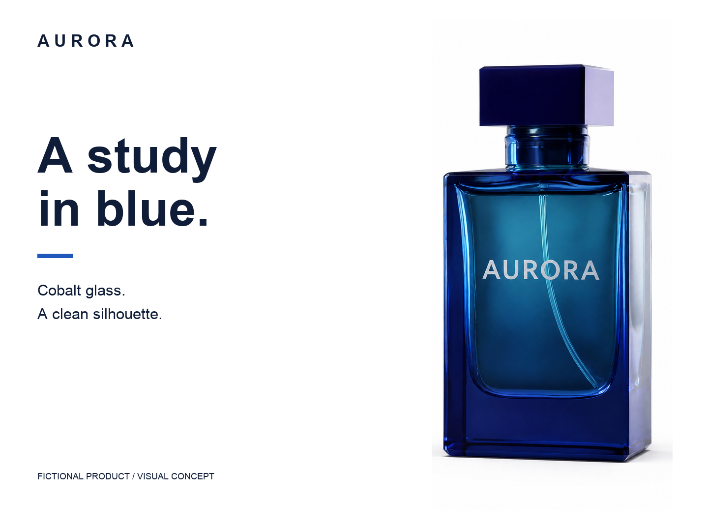

# AURORA: catalog image, listing layouts and editable brand kit

Created September 11, 2026 UTC with authenticated Magic Hour MCP and local composition. This is an original fictional product-page example, not a real perfume listing or a platform compliance certification. It exercises `magic-hour-marketplace-images` and `magic-hour-brand-kit` version 1.0.0.



## What you can use and inspect

| File                               | Actual deliverable                                                                               |
| ---------------------------------- | ------------------------------------------------------------------------------------------------ |
| [catalog.png](catalog.png)         | Untouched 2048 × 2048 MCP image-editor output; the clean main product image                      |
| [detail.png](detail.png)           | 1080 × 1080 secondary detail layout, cropped from the accepted catalog image                     |
| [brand-card.png](brand-card.png)   | 1440 × 1080 secondary brand layout with exact locally composed copy                              |
| [brand-guide.pdf](brand-guide.pdf) | Three rendered and visually inspected pages: application, identity rules and reusable files      |
| [wordmark.svg](wordmark.svg)       | Original geometric mark and editable text; a new concept, not a replacement for the bottle label |
| [render.py](render.py)             | Editable copy, colors, geometry and export source; no network or generation calls                |

The brand uses midnight `#101D38`, cobalt `#2057BD`, ice `#EAF2FA`, white space and Arial/Arial Bold. Keep the reference bottle and printed label intact. The separate wordmark is conceptual; no trademark clearance is claimed. Fonts are not bundled.

## Actual generation

Source: the [original AURORA still](../aurora/guided-image.png), a 640 × 360 synthetic image from the [first case](../aurora). It was uploaded unchanged, then passed to `ai_image_editor_create_image`.

- Model: `gpt-image-2`; requested resolution `2k`, ratio `1:1`, image count `1`.
- Project: `cmtwftd6t004dlk012yajt9og`; created at `2026-09-11T04:09:39.845Z`.
- Charge: **200 credits** for one attempt; no retries or discarded new generations. The reused source originally cost 5 credits, recorded in its case.
- Result: complete, downloaded and inspected. The original output has one readable AURORA label, a complete blue rectangular bottle and cap, a light background and a contact shadow.

Exact edit prompt:

> Edit this original fictional AURORA perfume photograph into one precise square catalog photo. Preserve the same cobalt-blue rectangular glass bottle, its bevels, slightly right-visible side, rectangular dark blue cap, short neck, and the single exact AURORA word on its front. The complete bottle and cap occupy about 82 percent of frame height, centered with comfortable margins. Clean pure white background, subtle contact shadow, even studio light that reveals blue glass and the original front geometry. Remove water droplets and the black stone setting. Show only this one bottle. Do not invent capacity, ingredients, packaging, extra labels or accessories. Do not change the viewing angle or redraw a different product. No promotional text.

The two additional layouts, SVG and guide consume **zero additional generation credits**. This is the incremental workflow benefit demonstrated here: accepted photography becomes several editable deliverables, rather than another paid image for each headline or placement.

## Reproduce or revise the layouts

Use Python with Pillow and ReportLab, plus locally licensed `Arial.ttf` and `Arial Bold.ttf`. From the repository root:

```sh
AURORA_FONT_DIR="/path/to/your/licensed/fonts" python3 examples/aurora-listing/render.py
```

On macOS the script defaults to `/System/Library/Fonts/Supplemental`. It overwrites only this example's derived layouts, wordmark and PDF; it reads `catalog.png` without modifying it. Change the copy in `render.py`, rerun and inspect the export. The PDF uses its standard Helvetica family for guide text; the raster application uses the specified Arial files.

## What remains unproven

The low-resolution original cannot establish exact unseen construction, material properties or label microgeometry. The edit reveals a more prominent internal tube and altered reflections; it is not proof of strict fidelity for a real commercial product. No ingredients, capacity or efficacy are inferred. The main and secondary assets serve a general fictional product page; a named marketplace requires current destination checks.

This case has no generic-MCP or Higgsfield output control. It verifies delivered files, exact copy, practical reuse and one actual generation, not a general quality win, conversion lift or customer retention. The SVG is locally authored vector geometry with live text, not an AI vector-generation endpoint. PPTX, packaging dielines and print production are supported workflow guidance but are not validated by this case.
