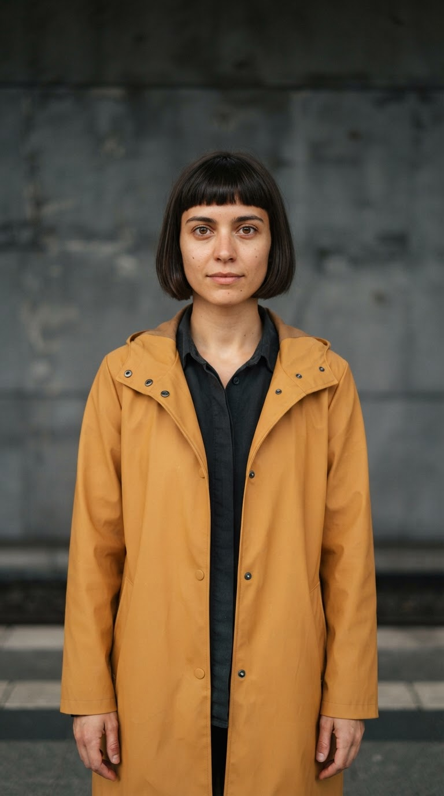

# First video: direct motion versus editing the still first

Run September 12, 2026 UTC through the authenticated Magic Hour creation MCP. One fictional subject, one attempt per workflow, no paid retries. This is a supervised workflow comparison, not an independent agent benchmark or a Higgsfield comparison.

**Observed result:** editing the start frame produced the requested midnight platform; direct animation retained the original gray wall. The guided video also introduced an unwanted ending fade. Neither original meets every requirement. The shorter export demonstrates reusing a take without paying for another generation; it does not satisfy the original five-second duration.

| Source                                                         | Edited start frame                                                                              |
| -------------------------------------------------------------- | ----------------------------------------------------------------------------------------------- |
|  |  |

**Watch:** [direct five-second video](direct.mp4) · [guided five-second video, including the fade](guided.mp4) · [three-second alternative, cropped to 9:16](guided-short.mp4).

## Same brief and video settings

> Make a five-second vertical video of this woman on a midnight railway platform with one luminous golden fish floating beside her shoulder. Keep her recognizable and in the same amber coat. The fish gently swishes its tail as she notices it with a small smile. Keep her face and the fish separate, camera locked, no cuts, no text and no audio.

Both workflows started from the same portrait, with a 300-credit ceiling each, `ltx-2.3`, `720p`, five seconds and audio disabled. The direct workflow sent the brief and original portrait to Image-to-Video. The guided workflow first used `nano-banana-2-lite` at `1k` to establish the scene, inspected that image, then sent a motion-focused prompt and the edited frame to the same video model. The current schema describes LTX as suited to rapid iteration; this is not a model-quality ranking.

The extra image edit and different prompts are the workflow being compared, not controlled-away differences. A capable agent without these skills could also choose that sequence. All requests and project IDs are in [requests.json](requests.json); private upload paths and expiring links are replaced by explicit source-file placeholders. No seed was supplied. These files reuse the original fictional [portrait's provenance](../midnight-remix).

| Observation                                        | Direct                                             | Guided                                           |
| -------------------------------------------------- | -------------------------------------------------- | ------------------------------------------------ |
| Generation credits charged                         | 240                                                | 290: 50 still + 240 video                        |
| Video request to downloaded file, observed         | 34.3 seconds                                       | 85.0 seconds                                     |
| First still request to downloaded video, observed  | Not applicable                                     | 162.3 seconds                                    |
| Downloaded original                                | 720 × 1296, 121 frames, 5.0417 seconds, no audio   | Same                                             |
| Recognizable face and amber coat in sampled frames | Pass                                               | Pass                                             |
| Requested midnight setting                         | Fail: gray wall remains                            | Pass in sampled frames                           |
| Floating fish separate from face                   | Visible after the opening; first frame has no fish | Visible in sampled frames, including the opening |
| Small reaction with head mostly still              | Larger smile/head movement than requested          | Larger head turn/smile than requested            |
| Ending visibility                                  | Subject remains visible                            | Fail: unrequested fade darkens face and fish     |
| Temporal smoothness and full-speed quality         | Unverified                                         | Unverified                                       |
| Independent preference or customer acceptance      | Unmeasured                                         | Unmeasured                                       |

Times include polling gaps and other work between calls. They are upper-bound observations of file availability, not isolated render latency. They exclude installation/authentication and final review; they do not prove a new user can finish in five minutes. Total experimental spend was **530 credits**, including the direct comparison. Historical charges are not current price quotes.

## Recovery and second edit

The guided wait initially timed out. Resuming the same project returned the completed file without another creation request or charge. Technical inspection decoded both videos successfully and found no black segments. Reviewing sampled frames and the final frame still revealed the fade: black detection is not a creative acceptance check.

The local second edit retains only the first three seconds and removes eight rows from each vertical edge to produce exact 720 × 1280 framing. The face and fish remain inside that crop in inspected frames. It costs zero additional generation credits and leaves the clean original intact:

```sh
ffmpeg -i guided.mp4 -t 3 -vf "crop=720:1280:0:8" -an -c:v libx264 -threads 1 -crf 18 -pix_fmt yuv420p -movflags +faststart guided-short.mp4
```

That shorter alternative avoids the observed ending fade; it is not a five-second quality pass. The instructions now explicitly check final exposure and preserve a project record for recovery and follow-on edits. Their revised ending guidance has not yet been validated in a new generation. No broad quality lift, activation improvement, retention or revenue effect is established by this case.

[Try your first video](../../docs/quickstart.md) · [First-video workflow](../../skills/magic-hour-image-to-video/references/first-video.md) · [All evidence and limitations](../../docs/evidence.md)
