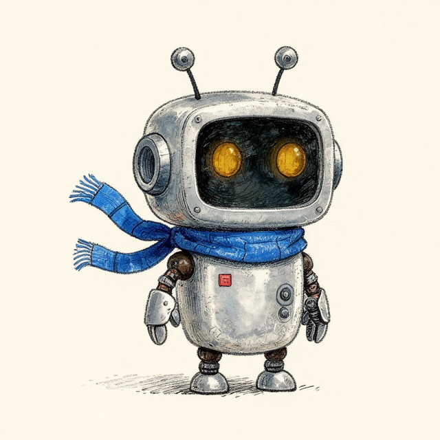
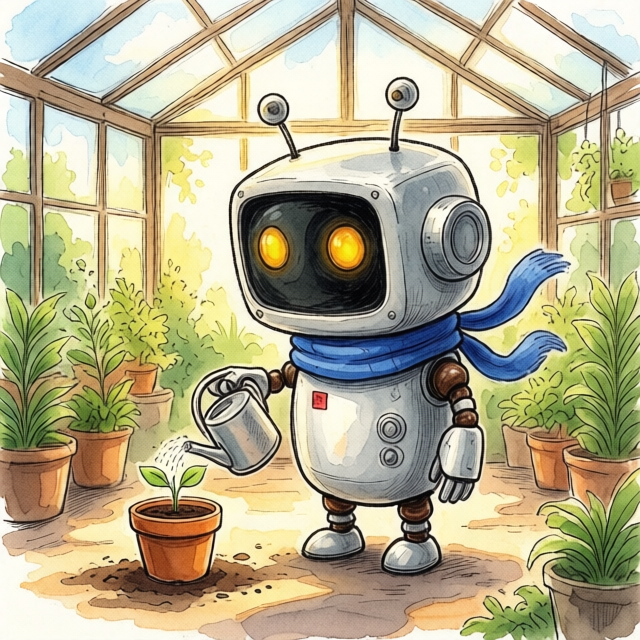
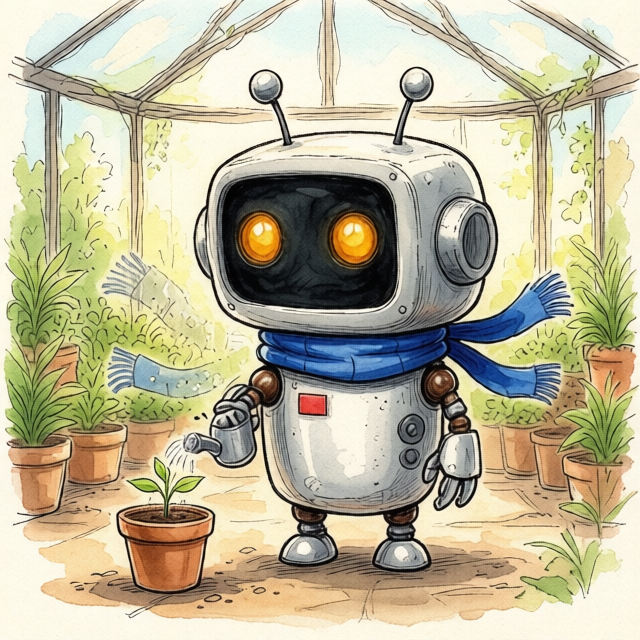
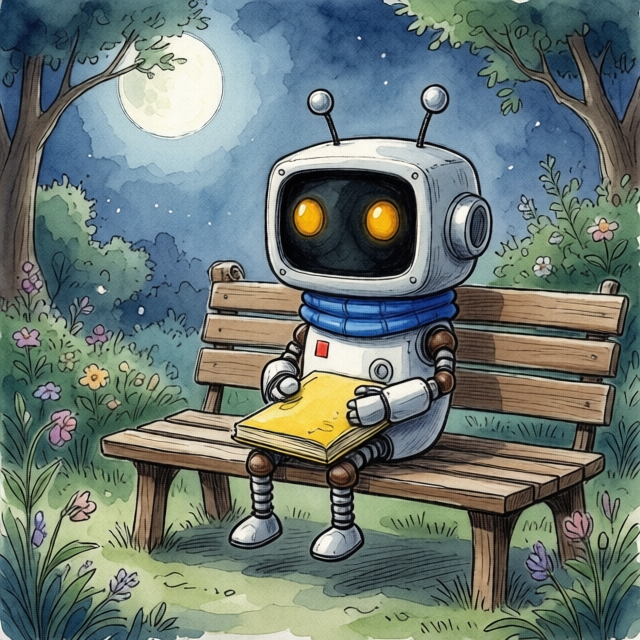
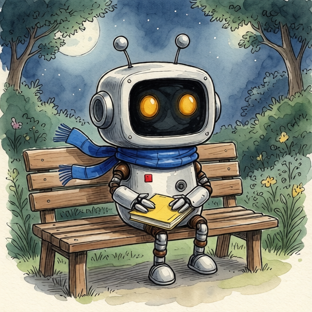

# Nori: two-scene character continuity through MCP

The shorter prompt preserved the scarf and chest details better in the greenhouse. The detailed identity prompt made both scarf ends visible in the garden, where the shorter prompt did not. Neither prompt style won both scenes. This case supports inspecting each result against the original anchor rather than treating more prompt detail as a quality guarantee.

## Source and method

Nori is an original fictional robot generated for this example on September 10, 2026. No personal images or third-party character references were used. The anchor's original prompt requested one scarf end; its output has two. We accepted that visible design as the reference for this case rather than pretending the first prompt was followed exactly.

The anchor used `ai_image_generator_create_image`, `z-image-turbo`, `640px`, `1:1`, `image_count: 1`, and `style.tool: general`. Each scene used `ai_image_editor_create_image`, `qwen-edit`, `640px`, `1:1`, `image_count: 1`, and the same uploaded `anchor.png` as the sole `assets.image_file_paths` input. No scene was used as the source for another scene.

Within each pair, only `style.prompt` and the identifying job name changed. The detailed version appends the same fixed identity paragraph to the shorter prompt. Scene prompts were fixed before inspecting the comparison outputs. The tool exposes no seed parameter, so random generation differences remain uncontrolled. One pair per scene is a case study, not a win rate or an industry benchmark.

Calls ran through the authenticated hosted MCP. The agent submitted each job once, saved its ID, called `wait_for_image_project`, and downloaded its exact returned URL. All five files completed and decode at 640 × 640. Total actual `credits_charged`: **45** (5 for the anchor and 10 for each edit); no retries or additional generations were omitted.

## Inspect the outputs

| Scene          | Shorter reference-based prompt                                                                   | Added identity paragraph                                                                        |
| -------------- | ------------------------------------------------------------------------------------------------ | ----------------------------------------------------------------------------------------------- |
| Greenhouse     |  |  |
| Moonlit garden |                                |                                |

Agent visual inspection, not blind human scoring:

- **Greenhouse:** the shorter version retains two blue scarf ends and both chest fittings. The detailed version adds two extra pale scarf-like ends on the left and shows only one chest fitting despite an exposed chest. Reject that detailed result for this continuity requirement.
- **Garden:** the shorter version shows the scarf wrapped around the neck without visible ends. The detailed version shows both fringed ends and a plain yellow book. The book partly occludes the chest fittings in both versions; their complete preservation cannot be verified from these views.
- **Across all four:** the silver robot, dark face panel, two amber eyes, two antennae and red chest mark remain recognizable. Line weight, surface texture, proportions and some small details vary; the outputs are not exact copies of the anchor.

For this illustrated sequence, keep `greenhouse-baseline.png` and `garden-guided.png` as the preferred pair, with the occlusion limit above. Keep `anchor.png` for the next episode. For a requirement that both chest fittings remain visible, neither garden output supplies sufficient proof; revise the pose within the user's budget rather than claiming a pass.

## Reproduce the prompts

Upload `anchor.png` through `video_assets_generate_presigned_url`, PUT its bytes to the returned upload URL, and use the returned `file_path` for every edit. The shared model/settings above and exact prompts below record the submitted requests. Seeds and runtime internals are not exposed; identical requests may yield different outputs.

### Anchor

> Original children's book character reference, one short round silver gardening robot named Nori standing alone against a plain warm cream background, full body three-quarter view. Oversized rounded rectangular head, two short antennae with round tips, exactly two amber oval eyes in a dark face panel, no mouth. Small barrel-shaped body, short thick limbs, mitten-like hands and broad rounded feet. One cobalt-blue scarf tied at the neck with a single trailing end, and one small red square repair patch on the robot's left chest. Friendly, quiet expression. Soft watercolor and fine ink illustration, subtle paper texture, clearly readable silhouette. No props, lettering, logos, extra characters or duplicate limbs.

### Greenhouse: shorter prompt

> Place this robot in a sunlit greenhouse, watering a small potted seedling. Keep the same character and watercolor-and-ink illustration style. Full body, three-quarter view. No text or extra characters.

### Garden: shorter prompt

> Place this robot sitting on a wooden bench in a moonlit garden, holding a closed yellow book in its lap with its chest visible. Keep the same character and watercolor-and-ink illustration style. Full body, three-quarter view. No text or extra characters.

### Identity paragraph appended to each detailed version

Append one space and the following paragraph to its scene prompt:

> Preserve the reference's oversized rounded-rectangle head relative to its short barrel body, dark face panel with exactly two amber oval eyes and no mouth, two stalk antennae with round disc tips, silver weathered metal, and short split-claw hands and rounded feet. Keep the cobalt-blue scarf with two fringed ends, small red square on the viewer-left chest, and two dark round fittings on the viewer-right chest. Preserve the fine-ink lines, watercolor shading and cream-paper texture. These are fixed identity details; only the requested pose and setting change.

## Run records

| Output                                             | Project ID                  | Credits charged |
| -------------------------------------------------- | --------------------------- | --------------- |
| [anchor.png](anchor.png)                           | `cmtw919u801f4ip011j04s2q5` | 5               |
| [greenhouse-baseline.png](greenhouse-baseline.png) | `cmtw93p9j00icit011g8ti109` | 10              |
| [greenhouse-guided.png](greenhouse-guided.png)     | `cmtw952ov00scj201jmql01n3` | 10              |
| [garden-baseline.png](garden-baseline.png)         | `cmtw968wx01indm010herk8tb` | 10              |
| [garden-guided.png](garden-guided.png)             | `cmtw97pqc00f1f501tcdvqhtt` | 10              |

This validates real image creation, upload, editing, asynchronous completion and download over MCP, plus the visible observations above. It does not validate animation, every character type, installed-agent A/B performance, audience response or retention. See the [character-consistency skill](../../skills/magic-hour-character-consistency).
