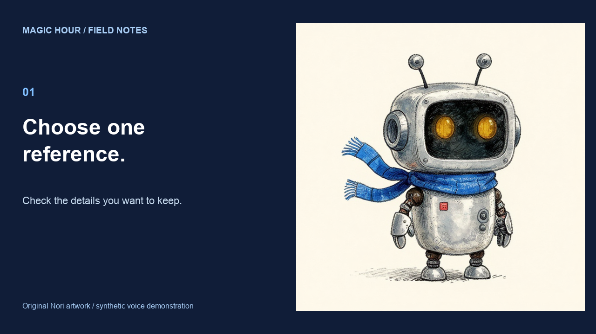

# Nori: a complete reference-first explainer

Created September 11, 2026 UTC with authenticated Magic Hour speech and image-to-video generation, previously accepted original images and local assembly. This exercises `magic-hour-explainer-video` version 1.0.0. **The audio has not received a listening review:** this agent environment does not support audio input. Do not treat it as an approved voice-quality example.

[Watch the 19.31-second MP4](explainer.mp4) · [Original narration](narration.wav) · [Editable render source](render.py) · [Exact timeline](timeline.ffconcat)



## Source and script

The explanation is based on the repository's [reference workflow and observed Nori results](../nori-character), not a claim that every longer prompt improves identity. The artwork is an original fictional robot. The scene files reuse the anchor, accepted greenhouse baseline and garden guided image; their original IDs, prompts, costs and observed defects remain in the source case.

Exact narration submitted to `ai_voice_generator_create_audio`:

> Start with one reference you like. Check the face, colors, and small details before making a new scene. Reuse that image when you change the setting. Inspect the result before adding motion. Keep the accepted files, so your next episode starts from work you already trust.

Voice: the API's **GLaDOS** synthetic preset, used as a labeled fictional robot demonstration. This is not an original custom voice, an endorsement or an affiliation with the character's owner. A professional customer request for an original narrator should use a suitable authorized voice rather than silently substituting this preset.

- Project `cmtwfybtm004alk0165466812`; created `2026-09-11T04:13:31.354Z`.
- One generation, **28 credits**, no paid retries. Previously generated image costs are recorded in the linked source case, not counted as new spend.
- Original WAV: 18.710 seconds, 24 kHz, mono. The export includes the full file and a 0.6-second tail; no sentence is intentionally truncated or sped up.
- MP4: 1280 × 720, 24 fps, H.264 and AAC; three locally composed scenes, with actual generated motion in the middle scene.
- Scene changes at 7.347 and 12.470 seconds use measured audio pause boundaries. They are editorial beat changes, not verified word-level caption alignment.

## Approved image to actual motion

The accepted [greenhouse still](../nori-character/greenhouse-baseline.png) was uploaded unchanged and passed to `image_to_video_create_video`: `ltx-2.3`, `720p`, requested 5 seconds, audio off. Project `cmtwg768w008rko01524sk1kj` completed for **240 credits**. Its [untouched MP4](greenhouse-motion.mp4) is 720 × 720, 24 fps, 121 frames, 5.041667 seconds. One attempt; no discarded motion runs. Total new generation cost for this case is **268 credits**.

Exact motion prompt:

> Locked camera. The little robot gently tips the existing watering can to water the small seedling, then holds still. Keep the original watercolor and ink style, the same rounded silver body, two amber eyes, two antenna tips, blue scarf with two ends, red chest square and greenhouse composition. Only the watering hand and a small stream of water move. No walking, talking, cuts, added characters, extra limbs, text or camera movement.

The robot waters the seedling and lowers the can. The broad identity and greenhouse remain recognizable. Its head, scarf and other arm also move, so the strict "only the watering hand" constraint fails; this is not perfect motion control. The final composition contains the complete generated clip and holds its last frame briefly before the next scene. Exact on-screen copy stays outside generation.

## Reuse and review

With Python, Pillow, FFmpeg and licensed Arial/Arial Bold files available, run from the repository root:

```sh
NORI_FONT_DIR="/path/to/your/licensed/fonts" python3 examples/nori-explainer/render.py
```

On macOS the font directory defaults to `/System/Library/Fonts/Supplemental`. This overwrites only derived scene PNGs, timeline and MP4. It leaves the original narration and source artwork untouched. Copy lives in `render.py`; the separate WAV can be replaced and the timing updated for a new language.

All 121 generated motion frames, the three composed scenes and the encoded file were inspected for dimensions, visual clipping and full audio-stream inclusion. Caption accuracy, pronunciation, voice naturalness and sentence-level audiovisual timing remain unverified. There are no burned-in captions presented as verified transcription. This is an assembly and reuse example, not evidence of superior voice quality, long-form video reliability or a Higgsfield comparison.
