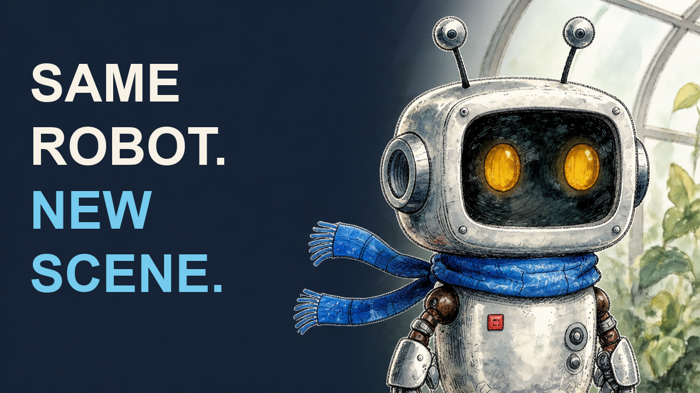
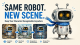
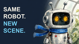

# Nori: a thumbnail with an editable headline

Run by Magic Hour on 2026-09-11 UTC through the authenticated hosted MCP. Two image edits completed; both are included. The finished cover adds local text composition, with no additional generation. This is a worked workflow comparison, not a Higgsfield comparison or an independently scored benchmark.

**Result:** both images preserved a recognizable Nori, and the direct image spelled the headline correctly. The direct version also added unrequested copy, icons and three miniature scenes. The planned version leaves one large subject and an editable headline. At 160 pixels wide, the direct version's extra material becomes difficult to read. We prefer the simpler result for this brief; audience preference and click-through impact are unmeasured.

| Direct request                                                                          | Planned visual + composed headline                                       |
| --------------------------------------------------------------------------------------- | ------------------------------------------------------------------------ |
|  |  |
|                                       |                           |

## Source and settings

Both calls used the same [original Nori anchor](../nori-character/anchor.png), an original fictional robot generated for our character case. Its source job and five-credit cost are recorded there. No real person's image, customer asset or competitor output was used.

| Field                             | Both runs                                                                                 |
| --------------------------------- | ----------------------------------------------------------------------------------------- |
| Tool                              | `ai_image_editor_create_image`                                                            |
| Model / resolution / aspect ratio | `gpt-image-2` / `1k` / `16:9`                                                             |
| Image count                       | `1` per call                                                                              |
| Actual downloaded dimensions      | 1360 × 768 for both; the requested `1k` setting did not produce a 1024-pixel longest edge |
| Direct job / charged credits      | `cmtwbwt2j00bpmp01en6q3p9c` / 100                                                         |
| Planned job / charged credits     | `cmtwbwtq900elh901g959x5ak` / 100                                                         |
| New generation spend              | 200 credits, two calls, no paid retries                                                   |
| Local finishing                   | 1280 × 720 PNG and 160 × 90 previews; zero additional generation credits                  |

Creation was submitted at 02:20 UTC and both completed files were retrieved at 02:25 UTC. We did other work before retrieval, so this interval is not measured generation latency. The API exposed no seed control. Prompt and finishing differed; one sample per route cannot isolate their causal contributions or establish a general win rate.

## Exact direct prompt

> Create a 16:9 cover for a tutorial about keeping this original robot recognizable across new scenes. Use the supplied robot and include the exact headline "SAME ROBOT. NEW SCENE." Make it clear and appealing at small size.

## Exact planned prompt

> Create a 16:9 editorial tutorial cover using the supplied robot reference. One large waist-up robot on the right half, with both antenna tips inside the frame and a calm curious expression. Keep its original watercolor-and-ink appearance, dark face panel, two amber oval eyes, blue scarf and red square chest detail. Suggest a greenhouse with just a few soft leaf shapes behind it; simplify small background detail. Keep the left 45 percent as uninterrupted dark navy negative space for a separate headline. Give the silver face a clear light silhouette against the dark background. No words, letters, logos, panels, arrows or extra characters.

The [uncomposed planned image](planned.png) preserves two eyes, two antennae, two scarf ends and the red chest detail. The scarf enters the requested left region near its lower edge; the delivered text layout avoids it. Background detail is greater than the prompt's “few soft leaf shapes,” and the lower body is intentionally cropped. It is usable for this cover, not an exact-identity or pixel-placement guarantee.

## Reproduce the finished cover

Run from this example folder with FFmpeg and a licensed Arial Bold font at the shown macOS path, or supply your own licensed font and recheck the layout. The font is not distributed. Copy is in [headline-top.txt](headline-top.txt) and [headline-bottom.txt](headline-bottom.txt); line breaks preserve the exact wording and punctuation. The crop removes three background rows before downscaling to exact 16:9.

```sh
ffmpeg -nostdin -v error -i planned.png \
  -vf "crop=1360:765:0:1,scale=1280:720:flags=lanczos,drawtext=fontfile='/System/Library/Fonts/Supplemental/Arial Bold.ttf':textfile=headline-top.txt:expansion=none:fontcolor=0xf7f2e5:fontsize=96:line_spacing=6:x=54:y=116,drawtext=fontfile='/System/Library/Fonts/Supplemental/Arial Bold.ttf':textfile=headline-bottom.txt:expansion=none:fontcolor=0x74cbed:fontsize=96:line_spacing=6:x=54:y=350" \
  -frames:v 1 -update 1 cover-reproduced.png
ffmpeg -nostdin -v error -i cover-reproduced.png \
  -vf scale=160:90:flags=lanczos -frames:v 1 -update 1 cover-small-reproduced.png
ffmpeg -nostdin -v error -i direct.png \
  -vf 'crop=1360:765:0:1,scale=160:90:flags=lanczos' \
  -frames:v 1 -update 1 direct-small-reproduced.png
```

All five PNG files were decoded and inspected. Both full-size originals and small previews remain available so readers can judge the tradeoff. A later headline change can edit the text files and recompose this accepted visual without calling Magic Hour again. Changing the wording may require resizing or reflow; editable does not mean every headline automatically fits.

**Not established:** click-through lift, viewer retention, performance across other subjects, installation-to-output behavior in every agent, or superiority to another provider. [Use the thumbnail recipe](../../skills/magic-hour-thumbnails/references/cover-design.md) · [All evidence](../../docs/evidence.md).
