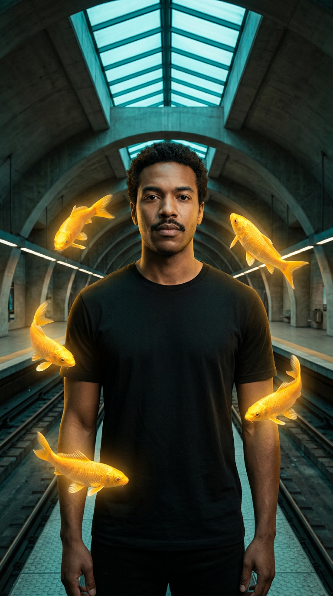
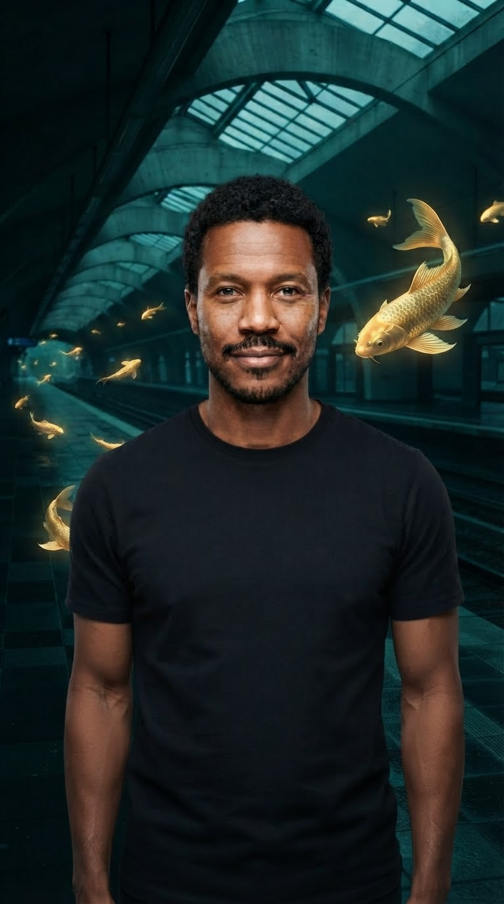

# Scene remixes: music, casting, body placement and recovery

Reuse an accepted performance, place a person in a new setting, recast one face in a group, or finish a musical sequence. These examples extend the original [midnight scene](../midnight-remix) with actual MCP outputs and a local music edit. All people and the fox are original fictional subjects.

**Run date:** September 11, 2026 UTC. [Exact prompts, inputs, project IDs and charges](requests.json) record every generation, including the failed placement and deliberate repairs. Face detection is recorded separately. These are route demonstrations, not a blind quality comparison or evidence of virality.

Eleven completed generation jobs charged **1,890 credits** in total; face detection charged zero. Both rejected takes and their repairs are retained. Local music composition, assembly and cropping required no additional generation credits.

## Try a finished result

- [Midnight Departure: eight-second vertical music cut](midnight-departure.mp4). Existing fox and moon footage, one deliberate cut, original instrumental, no new video generation for assembly.
- [A repaired personal placement animated](body-motion-vertical.mp4). Exact vertical export; keep the accepted identity and scene, then direct motion after the still is usable.
- [Selective photo face swap](selective-face-swap.png). Change the selected left face; visually retain the person on the right.
- [Character motion in its own setting](character-animate.mp4). Animate mode preserves the reference's studio, unlike the earlier replace-mode station shot.

Attach your source to a connected agent and ask: “Put me into this scene, preserve my identity, fix any placement errors before animation, and deliver the clip within my budget.” For music, supply your track and ask for a complete phrase; [the music skill](../../skills/magic-hour-music-video) selects the actual route.

## Body placement: inspect, repair, then animate

| Uncontrolled placement                                                     | Two-reference image repair                                                                |
| -------------------------------------------------------------------------- | ----------------------------------------------------------------------------------------- |
|  |  |

The [person reference](person.png) expands the earlier [headshot](../midnight-remix/alternate-face.png). It retains recognizable facial features, but the hands are not at the sides as requested. It supplies enough visible torso for this scene; it does not establish unseen lower-body details.

Body Swap received that person and the original [station image](../midnight-remix/keyframe.png). The result changes facial likeness and rebuilds the station around central tracks. It fails strict identity and destination-preservation requirements. The endpoint has no placement prompt or mask, so repeating the same request would not supply the missing control.

The repair uses the original station and person as two Image Editor references, with an explicit change/preserve prompt. The result has a visibly closer likeness and restores the side-platform setting. Framing and fine scene details still change; it is not a pixel-preserving edit. The repaired still is the input to [body-motion.mp4](body-motion.mp4), not the rejected Body Swap output.

The animation keeps the person front-facing with moving fish, but adds an open-mouth smile despite the requested closed mouth. All 121 frames were inspected in a contact sheet; full-speed temporal review remains outstanding. Neither an attractive still nor a successful request establishes perfect identity through motion.

The original motion output is 720 × 1296, 24 fps, 5.041667 seconds, without audio. The final [720 × 1280 export](body-motion-vertical.mp4) crops eight pixels from top and bottom at original speed; it preserves the visible face and fish in the reviewed frames. It uses no additional generation.

## Select one face in a group

The [original two-person cast](cast.png) contains one woman on the left and one man on the right. We ran face detection on that exact image and inspected both returned previews: [left](detected-left.png), [right](detected-right.png). Only the returned path for the left face was mapped to the original alternate headshot. The right face received no mapping.

The [result](selective-face-swap.png) shows the replacement features and facial hair on the left while retaining the left person's long hair, glasses and jacket; the right person is visually retained. The output is 1024 × 572, down from 1376 × 768. This is evidence for selective photo mapping, not tracking through video cuts, pixel-identical preservation or a full-body change. The API photo fields also differ from video: source/target paths versus image/video paths.

## Music routes are different products

[rooftop-theme.wav](rooftop-theme.wav) is an original locally synthesized eight-second, 120 BPM electronic instrumental: two four-second phrases, 24 kHz mono. It uses no external recording and was not generated by a Magic Hour music tool. Audio listening review is outstanding.

| Route                                | Actual output                                        | Observation and limit                                                                                                                                                                                                          |
| ------------------------------------ | ---------------------------------------------------- | ------------------------------------------------------------------------------------------------------------------------------------------------------------------------------------------------------------------------------ |
| Animation with `Pulse - Audio Sync`  | [audio-sync-animation.mp4](audio-sync-animation.mp4) | The scene evolves, but the person's identity/clothing change and the person dissolves near the end. Suitable only when that evolution is acceptable; not proof of artist identity preservation or beat accuracy.               |
| Audio-to-Video with a fox reference  | [audio-guided-video.mp4](audio-guided-video.mp4)     | Fox features and costume remain recognizable with facial movement. The studio background remains despite the requested rooftop/ribbons; the scene-direction requirement fails.                                                 |
| Local assembly from accepted footage | [midnight-departure.mp4](midnight-departure.mp4)     | First four seconds of the earlier fox station shot, then first four seconds of the moon reveal, over the full original instrumental. The cut is placed at the second phrase boundary. No listening or audience-response claim. |

Both MCP music outputs contain eight-second picture and audio streams. Stream duration alone does not establish that the soundtrack sounds right or synchronizes well. The web [Music Video Generator](https://magichour.ai/products/ai-music-video-generator) has a separate scene-assembly/optional singing workflow; it is not tested here and should not be equated with these MCP calls.

## Transfer the performance or reinterpret the style

[Character animate mode](character-animate.mp4) uses the same fox reference and source performance as the earlier [replace-mode result](../midnight-remix/character-replace.mp4). The fox follows the broad head-turn sequence in its reference studio instead of the source station. It returns 5.375 seconds for a 0–5-second request. Frame samples do not establish frame-exact action, full-speed smoothness, choreography or difficult object contact.

[Video-to-Video](restyle.mp4) uses the original performance, `Ink`, v2, `FULL` fps and a custom prompt. It returns a glossy colored reinterpretation with changed facial/costume details, rather than the requested ink treatment. The five-second file has 120 frames at 24 fps and 528 × 960 dimensions. This take is not a style or identity pass.

The [Video Editor repair](restyle-repair.mp4) returns to the original performance with an explicit monochrome, contour and crosshatching instruction. The reviewed samples show the person, fish and station rendered in black-and-white drawing style, with the broad head-turn sequence retained. Facial likeness and fine motion are not exact. This five-second, 704 × 1280, 24 fps output meets the visible style requirement more closely; both route and prompt changed, so this is a recovery example, not a controlled model comparison.

## Reproduce a route or reuse the edit

Upload the referenced local files, then replace each `<uploaded:filename>` placeholder in [requests.json](requests.json) with the matching returned `file_path`. For selective mapping, rerun detection on the uploaded cast, inspect the returned crops and use the intended face's actual returned path. The `<detected:cast-left>` placeholder is not a valid API value. Signed URLs and private upload paths are deliberately absent.

Keep the project ID after each creation and resume its wait/retrieve operation after a timeout. Use the live schema and current budget; historical credits are not price quotes. Reproducing a downstream operation can reuse these included inputs without paying to recreate them.

To reproduce the local music edit, run from this folder with FFmpeg installed. Both source clips are retained in the sibling case. The station is padded by eight pixels per side; the moon clip is cropped by eight pixels at top/bottom. The result is 720 × 1280, 24 fps, eight seconds for both picture and audio, without a held-frame extension or slowed footage.

```sh
ffmpeg -i ../midnight-remix/character-replace.mp4 -i ../midnight-remix/moon-elevator.mp4 -i rooftop-theme.wav \
  -filter_complex '[0:v]trim=duration=4,setpts=PTS-STARTPTS,pad=720:1280:8:0,setsar=1[a];[1:v]trim=duration=4,setpts=PTS-STARTPTS,crop=720:1280:0:8,setsar=1[b];[a][b]concat=n=2:v=1:a=0,fps=24[v]' \
  -map '[v]' -map 2:a -c:v libx264 -preset fast -crf 19 -pix_fmt yuv420p -c:a aac -b:a 160k -movflags +faststart midnight-departure.mp4
```

All media is decoded and probed; images are visually inspected. Video observations use sampled contact sheets across the clip, with all-frame review for body motion. Full-speed playback, auditory/singing validation, broad subject coverage and controlled superiority comparisons remain outstanding. See the [complete use-case map](../../docs/use-cases.md) for web finishing routes that are not exercised in this case.
